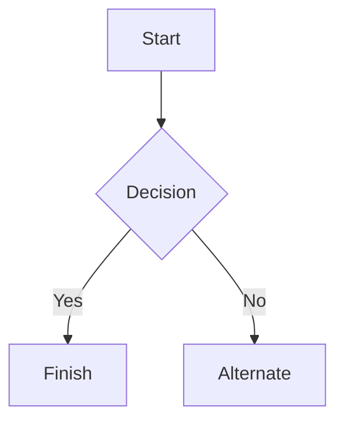

# CS 424 Assignment 1

#### Aidan Pina
#### Mohmed Patel

# Task 1: Observation and data collection plan

We decided to do data collection of an online auctioning app where people/companies will livestream and show the camera items/objects and people will be allowed to bid on them against others. We found this interesting because we enjoy thrifting vintage clothes and checking out big events like ThriftCon, IllinoisVintageFest, and Thrift2Death. So being able to buy thrifted clothing or other items online allows us to do one of our hobbies from the comfort of our own home without any drawbacks. We also have a lot of experience buying from the app over the past year and have spent more money than we should have.

### Initial Domain Questions to Investigate:

How does the number of viewers affect the final selling price of an item?

What types/styles of items receive the most bids?

How does an item's starting price relate to its final selling price?

Are certain categories of clothing consistently sold for higher prices?

How does the type of show affect the price an item sells for?

For this project, one observation is one piece of clothing sold during a Whatnot livestream. We watched streams live on the app from home over about a week and a half. For each item, we recorded the channel name and its follower count, the clothing type, the size, the starting bid, and the ending bid. On streams where it was possible, we also recorded the show format (auction or sudden death), the style (printed, embroidered, or blank), and the position of the brand symbol. We chose these attributes because we thought they could affect what a viewer would bid, and because they were the ones we could capture reliably in the few seconds each item is on screen.

To capture meaningful variation rather than a single snapshot, we deliberately watched streams that sold different things. One stream mostly sold Nike, another mostly Carhartt, and others sold a mix, so the data covers different clothing types, sizes, price levels, and sellers. We first planned to watch just one auctioneer, but realized that its regular viewers might know what to look for, which would make prices reflect one community and not the app more broadly (bias), so we spread our viewing across several auctioneers. To keep our recording consistent, we watched one stream together first to agree on how to record each attribute, then each watched multiple streams on our own. One part of our collection that we failed to capture was brand. This was because it was rarely named and auctioneers moved on within seconds, so we dropped it.

### Initial Data Dictionary

| Attribute  | Type	 | Description| Example |
| -------------|:-------------:|:-------------: |:-------------:|
|Channel Name |Categorical |The name of the auction channel/ seller|youthforeverwholesale |
|Style        |Categorical |The apparel style|Embroidered|
|Size         |Categorical |The size of the clothing |2XL |
|Starting Bid |Quantitative|The starting price of the clothing|5 |
|Ending Bid   |Quantitative|The final selling price of the clothing|180 |
|Type         |Categorical |The type of clothing|Crewneck |


# Task 2: Pilot and data collection

When we first started collecting the data and recording our attributes, we found that it was hard because of the speed some of the auctioneers were going. It definitely took a couple tries to collect all the attributes we wanted in the time frame that one piece of clothing was shown. One observation that was difficult to classify was the type of clothing. This was because it wasn’t mentioned half the time what kind of clothes it was. Additionally, if the auctioneer did mention what type of clothing it was, we believed it was actually something else. An example we can give is a hoodie with a zipper that the auctioneer said was just a hoodie. In order to keep everything consistent and concise,what we did was that we classified the piece of clothing to what we believed it was regardless of what the auctioneer said. We both had a general idea of what we wanted for this assignment so we did not have any different interpretations of attributes. An attribute that we wanted was brand. However it was very hard to figure out what brand each piece of clothing actually was. In the end we decided to remove that attribute. Every attribute we planned on adding was necessary except for brand. After doing the pilot, we realized we could answer a question that we previously did not think about. That question was “How does the number of viewers affect the final selling price of an item?” Because of the pilot, we are adding additional attributes (show title and bid type).

### Revised Data Dictionary

| Attribute  | Type	 | Description| Example |
| -------------|:-------------:|:-------------: |:-------------:|
|Channel Name |Categorical |The name of the auction channel/ seller|Youthforeverwholesale (yf.vtg), Mrtop Merchandise (Mrtop) |
|Style        |Categorical |The apparel style|Embroidered (EM), Printed (P), Blank (B)|
|Size         |Categorical |The size of the clothing |Small (S), Medium (M), Large (L), X-Large (XL), 2 X-Large (2XL), etc|
|Starting Bid |Quantitative|The starting price of the clothing|5|
|Ending Bid   |Quantitative|The final selling price of the clothing|100, 90, 30, 32, 0|
|Type         |Categorical |The type of clothing|Windbreaker, Jacket, Hoodie, Crewneck, etc|
|Show Title   |Categorical |Title of the livestream|VTG Sweater Show, Nike Show, Premium Sports Show|
|Bid Type     |Categorical |Type of auctioning in the stream |Auction or Sudden Death (SD)|  


# Task 3: Data description and domain questions

The dataset we collected is done per channel/livestream currently and is split by stream. All the streams watched and collected were clothing streams but they varied by type whether it was jackets, sweaters, or pants and there were also subtypes included. Each stream varied by size and length of the show but all attributes were applicable across all streams. This includes size of clothing (Categorical), stream name (Categorical), style (Categorical), clothing type (Categorical), starting bid (Quantitative), and ending bid (Quantitative). Overall everything was tough to record because most shows run items on a timer meaning we had only a few seconds to either remember or record all attributes while also monitoring several things per frame. This means that individual brands per show are unrealistic to record unless the shows themselves state the brand for the viewers.

During the streams we chose to capture size, stream title, style, clothing type, starting bid, and ending bid while we lost individual brand information, wear level/flaws, comments/activity, and prebid information on items that were prelisted. We decided making an item its own individual row was most appropriate especially for later visualization use since it would be easier to create graphs and charts if the data was easily split by shows or some other metric that repeats often. We chose to record everything the way it was displayed in the app so the starting/ending bid stayed quantitative/numerical since they were dollar amounts while everything else like style, type, size were categorical strings that could be abbreviated or easily typed.


Based on the data’s current state the most plausible domain questions would be:


- What types/styles of items receive the most bids?

Many different types and styles which could provide insight on what sways an item's price. 

* How does an item's starting price relate to its final selling price?

This could be compared if we add a few more streams with various starting prices but similar items.
* Are certain categories of clothing consistently sold for higher prices?

With so many categories of clothing especially in the vintage world it would be very easy to decipher a trend or pattern.
* How does the type of show affect the price an item sells for?

Visualizing price trend lines or caps based on the stream's bid type could easily present whether sudden death or auction produces more money.

# Task 4: Task abstractions

Translating the original and refined domain questions into abstract tasks helped us learn what we want to get out of the data rather than visualizations we can do. Our question of certain categories of clothes selling for higher prices becomes the abstract task of comparing ending bid values across clothing categories. Similarly for the question about types of shows impacting the price an item sells for helps to determine the relationship between bidding prices and time limits.Some of the other questions like the correlation between number of viewers and bid price are less possible because recording viewers at all times isn't feasible due to having to manually collect the data per item in such a short timespan. This is why we are now shifting our focus toward attributes that were consistently collected like size, style, type, starting bid, ending bid, and stream name or things that can easily split the data like stream type or stream channel. A main thing abstracting helped with is realizing it's more efficient to compare categories and identify patterns/relationships/trends rather than being tunnel visioned on a specific chart before understanding the task.

# Task 5:


## Emphasis

*This text will be italic*  
_This will also be italic_

**This text will be bold**  
__This will also be bold__

_You **can** combine them_

## Lists

### Unordered

* Item 1
* Item 2
* Item 2a
* Item 2b
    * Item 3a
    * Item 3b

### Ordered

1. Item 1
2. Item 2
3. Item 3
    1. Item 3a
    2. Item 3b

## Images


## Links

You may be using [Markdown Live Preview](https://markdownlivepreview.com/).

## Blockquotes

> Markdown is a lightweight markup language with plain-text-formatting syntax, created in 2004 by John Gruber with Aaron Swartz.
>
>> Markdown is often used to format readme files, for writing messages in online discussion forums, and to create rich text using a plain text editor.

## Tables

| Left columns  | Right columns |
| ------------- |:-------------:|
| left foo      | right foo     |
| left bar      | right bar     |
| left baz      | right baz     |

## Blocks of code

```
let message = 'Hello world';
alert(message);
```

## Mermaid diagrams


## Inline code

This web site is using `markedjs/marked`.
